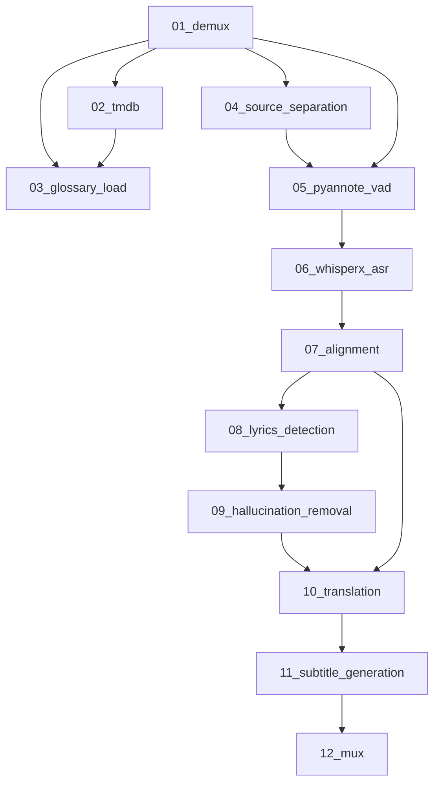

# Canonical 12-Stage Pipeline Architecture

**Version:** 1.0  
**Date:** 2025-12-04  
**Status:** ✅ ACTIVE - Single Source of Truth for Pipeline Architecture  
**System Version:** v2.9 (95% complete → v3.0)

---

## Purpose

This document defines the **canonical 12-stage pipeline architecture** for CP-WhisperX-App. It serves as the single source of truth for:
- Stage numbering and naming
- Stage purposes and responsibilities
- Mandatory vs optional classification
- Workflow execution paths
- Output directory structure
- Stage dependencies

**All other documents MUST reference this document for stage definitions.**

---

## Quick Reference

```
12-Stage Subtitle Workflow Pipeline:

01_demux → 02_tmdb → 03_glossary_load → 04_source_separation*
→ 05_pyannote_vad → 06_whisperx_asr → 07_alignment
→ 08_lyrics_detection** → 09_hallucination_removal**
→ 10_translation → 11_subtitle_generation → 12_mux

* Optional (adaptive based on audio quality)
** MANDATORY for subtitle workflow
```

---

## Stage Definitions

### Stage 01: Demux (Audio Extraction)

**File:** `scripts/01_demux.py`  
**Purpose:** Extract audio track from video file using FFmpeg  
**Input:** Video file (MP4, MKV, AVI, MOV, etc.) from `in/` directory  
**Output:** Audio WAV file in `01_demux/audio.wav`  
**Criticality:** MANDATORY (all workflows)  
**Device:** CPU only  
**Pattern:** StageIO with manifest tracking

**Features:**
- Automatic format detection
- Sample rate normalization (16kHz for ASR)
- Audio fingerprinting for caching
- Clipping support (start/end time)

**Dependencies:** None (first stage)

---

### Stage 02: TMDB Enrichment (Metadata Fetch)

**File:** `scripts/02_tmdb_enrichment.py`  
**Purpose:** Fetch movie metadata from TMDB API for context  
**Input:** Job configuration with media title  
**Output:** `02_tmdb/metadata.json` with cast, crew, character names  
**Criticality:** OPTIONAL (subtitle workflow only)  
**Device:** CPU only (API calls)  
**Pattern:** StageIO with manifest tracking

**Features:**
- TMDB API integration
- Character name extraction
- Cast and crew information
- Movie/TV show metadata

**Dependencies:** None (can run independently)  
**Workflow-Aware:** Only enabled for subtitle workflow

---

### Stage 03: Glossary Load (Term Dictionary)

**File:** `scripts/03_glossary_load.py`  
**Purpose:** Load and prepare glossary terms for context-aware processing  
**Input:** `glossary/` directory with term definitions  
**Output:** `03_glossary_load/glossary.json` with processed terms  
**Criticality:** RECOMMENDED (improves accuracy)  
**Device:** CPU only  
**Pattern:** StageIO with manifest tracking

**Features:**
- Character name loading (from TMDB)
- Cultural term dictionary
- Domain-specific terminology
- Proper noun preservation

**Dependencies:** Stage 02 (uses TMDB character names if available)

---

### Stage 04: Source Separation (Dialogue Extraction)

**File:** `scripts/04_source_separation.py`  
**Purpose:** Separate dialogue from background music/noise  
**Input:** `01_demux/audio.wav`  
**Output:** `04_source_separation/vocals.wav` (dialogue only)  
**Criticality:** OPTIONAL (adaptive - enabled for noisy audio)  
**Device:** GPU preferred, CPU fallback  
**Pattern:** StageIO with manifest tracking

**Features:**
- Spleeter-based separation
- Adaptive quality detection
- GPU acceleration (CUDA/MLX)
- Skip if audio is clean

**Dependencies:** Stage 01 (demux audio)

---

### Stage 05: PyAnnote VAD (Speech Detection)

**File:** `scripts/05_pyannote_vad.py`  
**Purpose:** Voice activity detection and speaker diarization  
**Input:** Audio (from stage 04 if available, else stage 01)  
**Output:** `05_pyannote_vad/segments.json` with speech segments  
**Criticality:** MANDATORY (all workflows)  
**Device:** GPU preferred, CPU fallback  
**Pattern:** StageIO with manifest tracking

**Features:**
- Voice activity detection
- Speaker diarization (who spoke when)
- Segment boundaries
- Silence removal

**Dependencies:** Stage 01 (or 04 if source separation enabled)

---

### Stage 06: WhisperX ASR (Transcription)

**File:** `scripts/06_whisperx_asr.py`  
**Purpose:** Automatic speech recognition with word-level timestamps  
**Input:** Audio + VAD segments from stage 05  
**Output:** `06_whisperx_asr/transcript.json` with word timestamps  
**Criticality:** MANDATORY (all workflows)  
**Device:** GPU required (CUDA/MLX)  
**Pattern:** StageIO with manifest tracking

**Features:**
- WhisperX large-v3 model
- Word-level timestamps
- Multi-language support
- Confidence scores

**Dependencies:** Stage 05 (VAD segments)

---

### Stage 07: Alignment (Word-Level Refinement)

**File:** `scripts/07_alignment.py`  
**Purpose:** Refine word-level timestamp alignment  
**Input:** `06_whisperx_asr/transcript.json`  
**Output:** `07_alignment/segments_aligned.json` with refined timestamps  
**Criticality:** MANDATORY (subtitle workflow)  
**Device:** GPU (MLX on Apple Silicon, CUDA elsewhere)  
**Pattern:** StageIO with manifest tracking

**Features:**
- MLX-based alignment (Apple Silicon)
- CUDA fallback for other platforms
- Improved timestamp accuracy
- Phoneme-level alignment

**Dependencies:** Stage 06 (ASR transcript)

---

### Stage 08: Lyrics Detection (Song Identification)

**File:** `scripts/08_lyrics_detection.py`  
**Purpose:** Detect and mark song/lyrics segments in transcript  
**Input:** `07_alignment/segments_aligned.json`  
**Output:** `08_lyrics_detection/transcript_with_lyrics.json`  
**Criticality:** **MANDATORY for subtitle workflow** (cannot be disabled)  
**Device:** CPU only  
**Pattern:** StageIO with manifest tracking

**Features:**
- Heuristic-based lyrics detection
- Pattern recognition (repetitive phrases)
- Music segment identification
- Lyrics flag in transcript

**Why Mandatory:**
- Bollywood movies have 4-8 song sequences
- Lyrics should NOT be translated literally
- Need special handling (original + transliteration)
- Cultural significance of songs

**Dependencies:** Stage 07 (aligned transcript)

---

### Stage 09: Hallucination Removal (Artifact Cleaning)

**File:** `scripts/09_hallucination_removal.py`  
**Purpose:** Remove ASR hallucinations and artifacts  
**Input:** `08_lyrics_detection/transcript_with_lyrics.json`  
**Output:** `09_hallucination_removal/transcript_cleaned.json`  
**Criticality:** **MANDATORY for subtitle workflow** (cannot be disabled)  
**Device:** CPU only  
**Pattern:** StageIO with manifest tracking

**Features:**
- Remove common hallucinations ("Thanks for watching", "Subscribe")
- Remove repeated phrases
- Remove artifacts from background music
- Remove silence-generated nonsense

**Why Mandatory:**
- WhisperX ALWAYS produces some hallucinations
- Background music causes artifacts
- Quality target (88%) impossible without removal
- Corrupts subtitle quality if not removed

**Dependencies:** Stage 08 (lyrics-marked transcript)

---

### Stage 10: Translation (Multi-Language)

**File:** `scripts/10_translation.py`  
**Purpose:** Translate transcript to target languages  
**Input:** `09_hallucination_removal/transcript_cleaned.json`  
**Output:** `10_translation/transcript_{lang}.json` for each target language  
**Criticality:** MANDATORY (translate and subtitle workflows)  
**Device:** GPU preferred (IndicTrans2), CPU fallback (NLLB)  
**Pattern:** StageIO with manifest tracking

**Features:**
- IndicTrans2 for Indian languages (highest quality)
- NLLB-200 for non-Indian languages
- Hybrid translation (IndicTrans2 + LLM for songs)
- Glossary term preservation
- Cultural context adaptation

**Dependencies:** Stage 09 (cleaned transcript) or Stage 07 (for transcribe workflow)

---

### Stage 11: Subtitle Generation (SRT/VTT Creation)

**File:** `scripts/11_subtitle_generation.py`  
**Purpose:** Generate subtitle files from translated transcripts  
**Input:** Translated transcripts from stage 10  
**Output:** `11_subtitle_generation/subtitles/{media}.{lang}.srt`  
**Criticality:** MANDATORY (subtitle workflow)  
**Device:** CPU only  
**Pattern:** StageIO with manifest tracking

**Features:**
- SRT and VTT format support
- Context-aware generation
- Timing optimization
- Multi-language support
- Character name attribution

**Dependencies:** Stage 10 (translated transcripts)

---

### Stage 12: Mux (Subtitle Embedding)

**File:** `scripts/12_mux.py`  
**Purpose:** Embed all subtitle tracks into video file  
**Input:** Original video + SRT files from stage 11  
**Output:** `12_mux/{media}_subtitled.mkv` with embedded subtitles  
**Criticality:** MANDATORY (subtitle workflow)  
**Device:** CPU only (FFmpeg)  
**Pattern:** StageIO with manifest tracking

**Features:**
- Soft subtitle embedding (can be toggled on/off)
- Multiple subtitle tracks
- Language metadata
- Original video preserved

**Dependencies:** Stage 11 (subtitle files)

---

## Workflow Execution Paths

### 1. Transcribe Workflow

**Purpose:** Create transcript in SAME language as source  
**Stages:** 01 → 02* → 03* → 04* → 05 → 06 → 07  
**Optional Stages:** 02 (TMDB), 03 (Glossary), 04 (Source Sep)

**Output:** `07_alignment/segments_aligned.json`

---

### 2. Translate Workflow

**Purpose:** Create transcript in TARGET language  
**Stages:** 01 → 02* → 03* → 04* → 05 → 06 → 07 → 10  
**Optional Stages:** 02 (TMDB), 03 (Glossary), 04 (Source Sep)

**Constraint:** Source language MUST be Indian language (for IndicTrans2)

**Output:** `10_translation/transcript_{target_lang}.json`

---

### 3. Subtitle Workflow (12-Stage Full Pipeline)

**Purpose:** Generate multi-language soft-embedded subtitles  
**Stages:** 01 → 02 → 03 → 04* → 05 → 06 → 07 → **08 → 09** → 10 → 11 → 12  
**Optional Stages:** 04 (Source Sep)  
**MANDATORY Stages:** 08 (Lyrics), 09 (Hallucination) - cannot be disabled

**Output:** `12_mux/{media}_subtitled.mkv` with all subtitle tracks

**Target Languages:** Up to 8 tracks (hi, en, gu, ta, te, es, ru, zh, ar)

---

## Output Directory Structure

Each job creates a directory structure:

```
out/{date}/{user}/{job}/
├── 01_demux/
│   ├── audio.wav                # Extracted audio
│   ├── stage.log               # Stage-specific log
│   └── manifest.json           # Stage manifest
├── 02_tmdb/
│   ├── metadata.json           # Movie metadata
│   └── stage.log
├── 03_glossary_load/
│   ├── glossary.json           # Processed terms
│   └── stage.log
├── 04_source_separation/       # Only if enabled
│   ├── vocals.wav              # Dialogue track
│   ├── accompaniment.wav       # Music track
│   └── stage.log
├── 05_pyannote_vad/
│   ├── segments.json           # Speech segments
│   ├── diarization.json        # Speaker info
│   └── stage.log
├── 06_whisperx_asr/
│   ├── transcript.json         # Raw transcript
│   └── stage.log
├── 07_alignment/
│   ├── segments_aligned.json   # Refined timestamps
│   └── stage.log
├── 08_lyrics_detection/        # Subtitle workflow only
│   ├── transcript_with_lyrics.json
│   └── stage.log
├── 09_hallucination_removal/   # Subtitle workflow only
│   ├── transcript_cleaned.json
│   └── stage.log
├── 10_translation/             # Translate/Subtitle workflows
│   ├── transcript_en.json
│   ├── transcript_gu.json
│   ├── transcript_ta.json
│   └── stage.log
├── 11_subtitle_generation/     # Subtitle workflow only
│   ├── subtitles/
│   │   ├── movie.hi.srt
│   │   ├── movie.en.srt
│   │   └── movie.gu.srt
│   └── stage.log
├── 12_mux/                     # Subtitle workflow only
│   ├── movie_subtitled.mkv     # Final output
│   └── stage.log
├── logs/
│   └── pipeline.log            # Main pipeline log
├── job.json                    # Job configuration
└── manifest.json               # Job-level manifest
```

**Key Principles:**
- ✅ Each stage writes ONLY to its own directory
- ✅ No shared directories (except logs/)
- ✅ No legacy `media/`, `transcripts/`, `subtitles/` directories
- ✅ Complete data lineage via manifests

---

## Stage Dependencies



**Notes:**
- Stage 04 (source separation) is optional - pipeline can skip it
- Stages 08-09 are MANDATORY for subtitle workflow
- Translate workflow bypasses stages 08-09, 11-12
- Transcribe workflow uses only stages 01-07

---

## Mandatory vs Optional Classification

### Always Mandatory (All Workflows)
- ✅ 01_demux - Audio extraction
- ✅ 05_pyannote_vad - Speech detection
- ✅ 06_whisperx_asr - Transcription

### Workflow-Specific Mandatory

**Transcribe:**
- ✅ 07_alignment - Word-level timestamps

**Translate:**
- ✅ 07_alignment - Word-level timestamps
- ✅ 10_translation - Translation to target language

**Subtitle:**
- ✅ 02_tmdb - Metadata for context
- ✅ 03_glossary_load - Terms for accuracy
- ✅ 07_alignment - Word-level timestamps
- ✅ **08_lyrics_detection - MANDATORY (cannot disable)**
- ✅ **09_hallucination_removal - MANDATORY (cannot disable)**
- ✅ 10_translation - Multi-language translation
- ✅ 11_subtitle_generation - SRT/VTT creation
- ✅ 12_mux - Subtitle embedding

### Optional/Adaptive
- ⚪ 04_source_separation - Only if audio is noisy

---

## Stage Naming Convention

**Format:** `{NN}_{stage_name}.py`

**Rules:**
1. ✅ Two-digit stage number (01-12)
2. ✅ Underscore separator
3. ✅ Descriptive stage name (lowercase, underscores for spaces)
4. ✅ Python extension (.py)

**Examples:**
- ✅ `01_demux.py`
- ✅ `08_lyrics_detection.py`
- ✅ `11_subtitle_generation.py`
- ❌ `demux.py` (missing number)
- ❌ `8_lyrics.py` (single digit)
- ❌ `08-lyrics-detection.py` (hyphens instead of underscores)

---

## Stage Implementation Standards

All stages MUST follow these standards:

### 1. StageIO Pattern
```python
from shared.stage_utils import StageIO

def run_stage(job_dir: Path, stage_name: str = "01_demux") -> int:
    io = StageIO(stage_name, job_dir, enable_manifest=True)
    logger = io.get_stage_logger()
    
    try:
        # Stage logic
        io.manifest.add_input("input_key", input_file, "description")
        io.manifest.add_output("output_key", output_file, "description")
        io.finalize_stage_manifest(exit_code=0)
        return 0
    except Exception as e:
        logger.error(f"Stage failed: {e}", exc_info=True)
        io.finalize_stage_manifest(exit_code=1)
        return 1
```

### 2. Required Elements
- ✅ Uses `StageIO` with `enable_manifest=True`
- ✅ Uses `io.get_stage_logger()` (not print)
- ✅ Tracks all inputs via `add_input()`
- ✅ Tracks all outputs via `add_output()`
- ✅ Writes ONLY to `io.stage_dir`
- ✅ Finalizes manifest on completion
- ✅ Proper error handling with logging

### 3. Manifest Tracking
- Track input files with hash
- Track output files with hash
- Track intermediate files (optional)
- Document stage configuration
- Record execution time
- Log errors and warnings

---

## Quality Baselines

### Standard Test Media

**Sample 1: English Technical**
- File: `in/Energy Demand in AI.mp4`
- ASR Target: ≥95% WER
- Translation Target: ≥90% BLEU

**Sample 2: Hinglish Bollywood**
- File: `in/test_clips/jaane_tu_test_clip.mp4`
- ASR Target: ≥85% WER
- Subtitle Quality: ≥88%
- Context Awareness: ≥80%

---

## Version History

| Version | Date | Changes |
|---------|------|---------|
| 1.0 | 2025-12-04 | Initial creation - 12-stage pipeline documented |

---

## References

- **Implementation Tracker:** `IMPLEMENTATION_TRACKER.md`
- **Architecture Roadmap:** `docs/ARCHITECTURE_IMPLEMENTATION_ROADMAP.md`
- **Developer Standards:** `docs/developer/DEVELOPER_STANDARDS.md`
- **Copilot Instructions:** `.github/copilot-instructions.md` (§ 1.5)
- **Output Structure:** `OUTPUT_DIRECTORY_RESTRUCTURE_SUMMARY.md`
- **Subtitle Integration:** `SUBTITLE_WORKFLOW_INTEGRATION_COMPLETION_REPORT.md`

---

**Maintained By:** Development Team  
**Review Frequency:** Monthly or when architecture changes  
**Status:** ✅ ACTIVE - All documentation must reference this file
