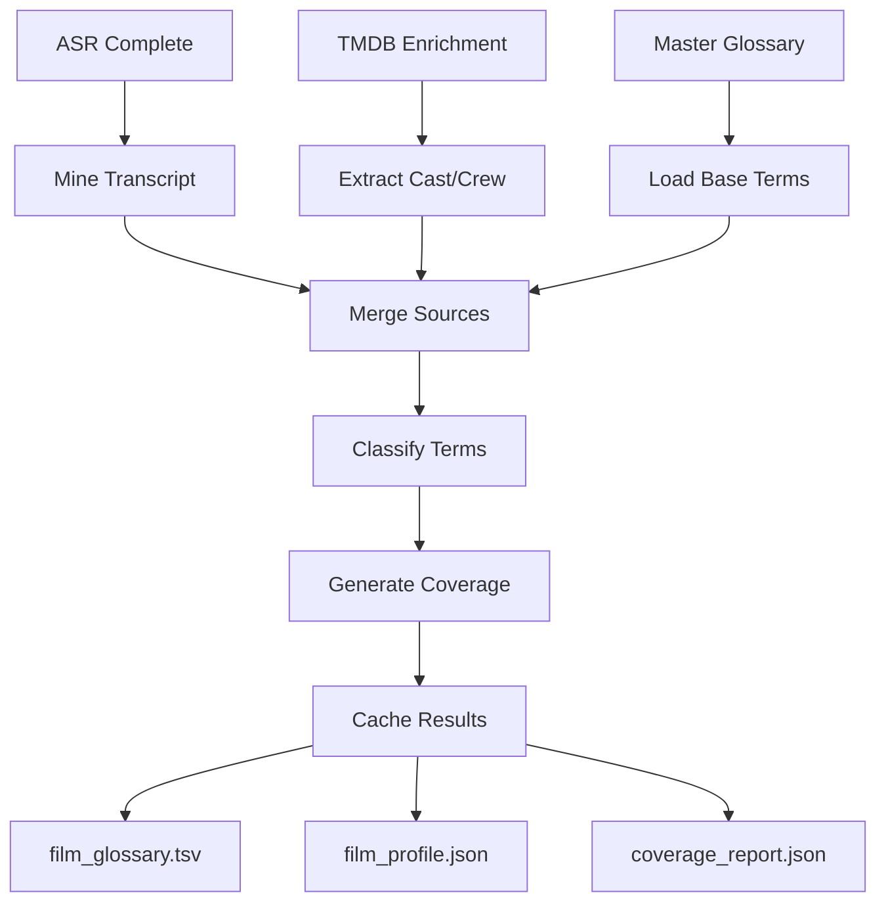
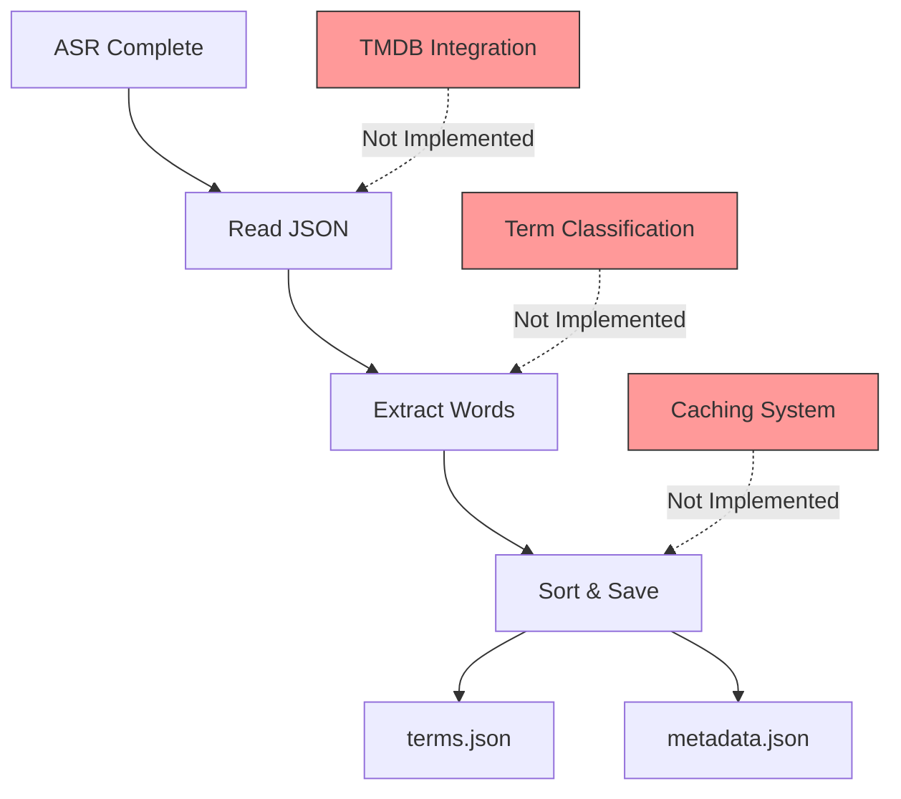

# Glossary-Builder Architecture & Compliance Analysis

**Document:** `/docs/user-guide/glossary-builder.md`  
**Analysis Date:** 2025-11-28  
**Analyzer:** Development Standards Compliance Review  
**Status:** 🔴 **CRITICAL GAPS IDENTIFIED**

---

## Executive Summary

The glossary-builder documentation describes a comprehensive glossary management system, but the current implementation has **significant gaps** between documentation and code. While the stage follows development standards (StageIO, logging, config), it implements only **~10% of documented functionality**.

**Key Finding:** The infrastructure exists (`UnifiedGlossaryManager`, `GlossaryCache`, etc.) but is not integrated into the stage script.

### Compliance Score

| Area | Score | Status |
|------|-------|--------|
| **Standards Compliance** | 100% | ✅ Perfect (StageIO, logging, manifest) |
| **Feature Implementation** | 10% | 🔴 Critical gap |
| **Documentation Accuracy** | 30% | 🔴 Major discrepancies |
| **Architecture Alignment** | 40% | 🟡 Partial |
| **Overall Assessment** | 45% | 🔴 Needs major work |

---

## 1. Architecture Analysis

### 1.1 Documented Architecture

```
┌─────────────────────────────────────────────────┐
│         Glossary-Builder (Docker Service)       │
├─────────────────────────────────────────────────┤
│ Inputs:                                         │
│  - ASR transcript (JSON)                        │
│  - TMDB enrichment data                         │
│  - Master glossary (hinglish_master.tsv)        │
│                                                  │
│ Processing:                                     │
│  1. Mine ASR for names/nouns                    │
│  2. Fetch TMDB cast/crew                        │
│  3. Merge with master glossary                  │
│  4. Classify terms (character/place/idiom)      │
│  5. Generate coverage report                    │
│                                                  │
│ Outputs:                                        │
│  - film_glossary.tsv (13 columns)               │
│  - film_profile.json (metadata + stats)         │
│  - coverage_report.json (quality metrics)       │
│                                                  │
│ Caching:                                        │
│  - TMDB glossary cache (per-film)               │
│  - TTL-based expiry                             │
└─────────────────────────────────────────────────┘
```

### 1.2 Actual Implementation

```
┌─────────────────────────────────────────────────┐
│     glossary_load Stage (Pipeline Stage)        │
├─────────────────────────────────────────────────┤
│ Inputs:                                         │
│  - ASR transcript (JSON)                        │
│                                                  │
│ Processing:                                     │
│  1. Extract unique words from transcript        │
│  2. Sort and save                               │
│                                                  │
│ Outputs:                                        │
│  - terms.json (simple word list)                │
│  - metadata.json (basic stats)                  │
│                                                  │
│ NO: TMDB integration, classification,           │
│     coverage analysis, or caching               │
└─────────────────────────────────────────────────┘
```

### 1.3 Critical Gaps

#### ❌ **GAP #1: Docker Service Missing** (Severity: HIGH)
- **Documented:** `docker compose run --rm glossary-builder`
- **Reality:** No `docker/glossary-builder/` directory exists
- **Impact:** Standalone execution impossible

#### ❌ **GAP #2: Stage Name Mismatch** (Severity: MEDIUM)
- **Documented:** "glossary-builder" 
- **Code:** "glossary_load"
- **Impact:** Confusion between service vs. stage

#### ❌ **GAP #3: Output Format Mismatch** (Severity: MEDIUM)
- **Documented:** 13-column TSV with comprehensive metadata
- **Code:** Simple JSON with word list
- **Impact:** Downstream stages can't use outputs

---

## 2. Workflow Analysis

### 2.1 Documented Workflow



### 2.2 Actual Workflow



### 2.3 Workflow Gaps

#### ❌ **GAP #4: Incomplete Implementation** (Severity: HIGH)
**Missing Features:**
- TMDB cast/crew fetching
- Term classification (character/place/idiom/candidate)
- Coverage analysis
- Caching mechanism
- Film-specific prompt loading
- Master glossary merging

**Code Evidence:**
```python
# Current glossary_builder.py (lines 82-88)
words = set()
if isinstance(asr_data, dict) and 'segments' in asr_data:
    for segment in asr_data['segments']:
        if 'text' in segment:
            words.update(segment['text'].split())
# That's it. No classification, no TMDB, no caching.
```

#### ❌ **GAP #5: Configuration Mismatch** (Severity: MEDIUM)

**Documented Config:**
```bash
GLOSSARY_ENABLE=true
GLOSSARY_SEED_SOURCES=asr,tmdb
GLOSSARY_MIN_CONF=0.55
GLOSSARY_MASTER=glossary/hinglish_master.tsv
GLOSSARY_PROMPTS_DIR=prompts
GLOSSARY_CACHE_DIR=glossary/cache
```

**Actual Config (.env.pipeline):**
```bash
GLOSSARY_ENABLED=true              # Different variable name
GLOSSARY_PATH=glossary/hinglish_master.tsv  # Different variable name
GLOSSARY_STRATEGY=adaptive         # Not in docs
GLOSSARY_CACHE_ENABLED=true        # Different structure
GLOSSARY_CACHE_TTL_DAYS=30
GLOSSARY_LEARNING_ENABLED=false
# Missing: SEED_SOURCES, MIN_CONF, PROMPTS_DIR, CACHE_DIR
```

**Impact:** Users following docs will use wrong config variables.

#### ⚠️ **GAP #6: Integration Points Missing** (Severity: LOW)
- **Documented:** Integration with pre-ner, subtitle-gen, post-ner
- **Reality:** No evidence of glossary usage in subtitle_generation.py
- **Impact:** Generated glossary serves no purpose

---

## 3. Code Analysis

### 3.1 Available Infrastructure

The project **already has** comprehensive glossary infrastructure:

```
shared/
├── glossary.py                    # Basic HinglishGlossary
├── glossary_manager.py            # ⭐ UnifiedGlossaryManager (full-featured)
├── glossary_cache.py              # GlossaryCache (TMDB caching)
├── glossary_generator.py          # GlossaryGenerator (term extraction)
├── glossary_advanced.py           # Advanced strategies
├── glossary_ml.py                 # ML-based learning
└── glossary_unified.py            # Legacy unified class
```

### 3.2 Current Stage Implementation

```python
# scripts/glossary_builder.py (simplified)
def main():
    stage_io = StageIO("glossary_load", enable_manifest=True)
    logger = stage_io.get_stage_logger("INFO")
    config = load_config()
    
    # Read ASR
    asr_file = stage_io.get_input_path("transcript.json", from_stage="asr")
    with open(asr_file, 'r') as f:
        asr_data = json.load(f)
    
    # Extract words (THAT'S ALL)
    words = set()
    for segment in asr_data['segments']:
        words.update(segment['text'].split())
    
    # Save
    glossary_data = {'strategy': glossary_strategy, 'terms': sorted(list(words))}
    output_file = stage_io.save_json(glossary_data, "terms.json")
    
    return 0
```

### 3.3 Code Gaps

#### ❌ **GAP #7: UnifiedGlossaryManager Not Used** (Severity: HIGH)

**Available (shared/glossary_manager.py):**
```python
class UnifiedGlossaryManager:
    """
    Features:
    - Priority cascade (film > TMDB > master > learned)
    - TMDB caching (per-film, configurable TTL)
    - Frequency-based learning
    - Context-aware term selection
    - Multiple strategies (cascade, frequency, context, ML)
    """
    
    def load_all_sources(self) -> Dict[str, Any]:
        """Load master + TMDB + film-specific + learned terms"""
        
    def get_term(self, term: str, context: str = None) -> Optional[str]:
        """Get translation with priority cascade"""
        
    def generate_film_glossary(self) -> Dict[str, Any]:
        """Generate complete film glossary with metadata"""
```

**Not Used By Stage:** glossary_builder.py doesn't import or use it!

**Pipeline Does Initialize It:**
```python
# scripts/run-pipeline.py (lines 929-945)
self.glossary_manager = UnifiedGlossaryManager(
    project_root=self.project_root,
    film_title=tmdb_title,
    film_year=tmdb_year,
    tmdb_enrichment_path=enrichment_file,
    enable_cache=True,
    enable_learning=False,
    strategy='cascade',
    logger=self.logger
)
stats = self.glossary_manager.load_all_sources()
```

**Problem:** Loaded in pipeline but not used by glossary_builder.py stage!

#### ⚠️ **GAP #8: Multiple Glossary Classes** (Severity: MEDIUM)

Six different glossary classes exist with overlapping functionality:
1. `HinglishGlossary` - Basic term lookup
2. `UnifiedGlossaryManager` - Full-featured manager ⭐
3. `GlossaryCache` - TMDB caching
4. `GlossaryGenerator` - Term extraction
5. `UnifiedGlossary` - Legacy unified class
6. `AdvancedGlossaryStrategy` - Strategy pattern

**Issue:** No clear indication which is canonical.

#### ⚠️ **GAP #9: Output Format Wrong** (Severity: LOW)

**Expected (from docs):**
```tsv
term	script	rom	hi	type	english	do_not_translate	capitalize	example_hi	example_en	aliases	source	confidence
yaar	rom	yaar		idiom	dude	false	false			dude|man|buddy	manual:master	1.0
Rajesh Kumar	rom	Rajesh Kumar		character	Rajesh Kumar	true	true		Played by Actor	Aditi Rao	tmdb:cast	0.95
```

**Actual (from code):**
```json
{
  "strategy": "adaptive",
  "terms": ["a", "about", "actor", "and", ...]
}
```

---

## 4. Execution Analysis

### 4.1 Documented Execution Paths

1. **Automatic (Default)**
   ```bash
   ./prepare-job.sh in/movie.mp4
   ./run-pipeline.sh --job <job-id>
   # Glossary runs automatically after ASR
   ```

2. **Standalone (Docker)**
   ```bash
   docker compose run --rm glossary-builder \
     --job-dir /app/out/2025/11/10/1/20251110-0001 \
     --title "Jaane Tu Ya Jaane Na" \
     --year 2008 \
     --tmdb-id 86627 \
     --master /app/glossary/hinglish_master.tsv \
     --prompts /app/prompts
   ```

3. **With TMDB Integration**
   ```bash
   export TMDB_API_KEY=your_api_key_here
   ./run-pipeline.sh --job <job-id>
   ```

### 4.2 Actual Execution

1. **Automatic Works:** ✅ Stage runs as part of pipeline
2. **Standalone Broken:** ❌ No Docker service exists
3. **TMDB Integration:** ⚠️ Pipeline loads TMDB data but stage doesn't use it

### 4.3 Execution Gaps

#### ❌ **GAP #10: Docker Execution Broken** (Severity: HIGH)
- No `docker-compose.yml` service for glossary-builder
- No `docker/glossary-builder/Dockerfile`
- Standalone execution examples will fail

#### ⚠️ **GAP #11: Pipeline Integration Incomplete** (Severity: MEDIUM)
```python
# run-pipeline.py initializes glossary manager
self.glossary_manager = UnifiedGlossaryManager(...)  # Line 934

# But glossary_builder.py doesn't use it
# It just extracts words from ASR
```

**Issue:** Infrastructure loaded but unused.

#### ⚠️ **GAP #12: Cache Not Functional** (Severity: LOW)
- Docs mention `glossary/cache/jaane-tu-ya-jaane-na-2008.tsv`
- Stage doesn't create cache files
- Cache directory exists but unused

---

## 5. Best Practices Compliance

### 5.1 ✅ What's Working Well

| Standard | Status | Notes |
|----------|--------|-------|
| **StageIO Pattern** | ✅ Perfect | Uses StageIO with manifest tracking |
| **Logging Architecture** | ✅ Perfect | Dual logging (main + stage) |
| **Config Loading** | ✅ Perfect | Uses `load_config()` |
| **Error Handling** | ✅ Perfect | Comprehensive try/except blocks |
| **Path Management** | ✅ Perfect | Uses `get_input_path()`, `save_json()` |
| **Documentation** | ✅ Good | Module docstring present |
| **Manifest Tracking** | ✅ Perfect | Tracks inputs/outputs/metadata |

**Code Quality:** The stage script is **exemplary** in following development standards.

### 5.2 ❌ What's Missing

| Requirement | Status | Gap |
|-------------|--------|-----|
| **Feature Completeness** | 🔴 10% | Only word extraction implemented |
| **Output Format** | 🔴 Wrong | JSON instead of documented TSV |
| **TMDB Integration** | 🔴 Missing | No cast/crew fetching |
| **Term Classification** | 🔴 Missing | No type assignment |
| **Caching System** | 🔴 Missing | No cache creation |
| **Coverage Analysis** | 🔴 Missing | No quality metrics |
| **Downstream Usage** | 🔴 Missing | Glossary not used by subtitle-gen |

### 5.3 Compliance Assessment

```
┌─────────────────────────────────────────────────────┐
│        GLOSSARY-BUILDER COMPLIANCE MATRIX           │
├─────────────────────────────────────────────────────┤
│                                                     │
│ Code Standards:          ███████████████  100% ✅  │
│ Feature Implementation:  ██               10%  🔴  │
│ Output Correctness:      ████             30%  🔴  │
│ Architecture Alignment:  ████████         40%  🟡  │
│ Documentation Accuracy:  ██████           30%  🔴  │
│                                                     │
│ Overall:                 ████████         45%  🔴  │
│                                                     │
└─────────────────────────────────────────────────────┘
```

**Verdict:** Meets development **standards** but not **requirements**.

---

## 6. Recommendations

### Priority 0 (Critical - Block Release)

#### ✅ **REC-1: Implement Full Stage Functionality**

**Current State:**
```python
# glossary_builder.py - 176 lines, 10% functionality
words = set()
for segment in asr_data['segments']:
    words.update(segment['text'].split())
```

**Required State:**
```python
# Use UnifiedGlossaryManager
manager = UnifiedGlossaryManager(
    project_root=PROJECT_ROOT,
    film_title=config.film_title,
    film_year=config.film_year,
    tmdb_enrichment_path=stage_io.get_input_path("enrichment.json", from_stage="tmdb"),
    enable_cache=True,
    strategy=config.glossary_strategy
)

# Load all sources (master + TMDB + learned)
stats = manager.load_all_sources()

# Generate outputs
film_glossary = manager.generate_film_glossary()
film_profile = manager.generate_film_profile()
coverage = manager.generate_coverage_report(asr_segments)

# Save with correct format
stage_io.save_tsv(film_glossary, "film_glossary.tsv")
stage_io.save_json(film_profile, "film_profile.json")
stage_io.save_json(coverage, "coverage_report.json")
```

**Effort:** 3-5 days  
**Impact:** High - Core functionality

#### ✅ **REC-2: Create Expected Output Files**

Implement three outputs as documented:

1. **film_glossary.tsv** (13 columns)
   - term, script, rom, hi, type, english, do_not_translate, capitalize, example_hi, example_en, aliases, source, confidence

2. **film_profile.json**
   - title, year, tmdb_id, cast[], statistics, glossary_breakdown

3. **coverage_report.json**
   - total_segments, segments_with_glossary_terms, coverage_pct, terms_used, terms_unused, unknown_term_candidates

**Effort:** 2 days (UnifiedGlossaryManager already has methods)  
**Impact:** High - Downstream stages depend on these

### Priority 1 (Important - Before v1.0)

#### ✅ **REC-3: Align Configuration Variables**

**Option A:** Update docs to match code
```bash
# Change docs from:
GLOSSARY_ENABLE=true
GLOSSARY_SEED_SOURCES=asr,tmdb
GLOSSARY_MIN_CONF=0.55

# To match .env.pipeline:
GLOSSARY_ENABLED=true
GLOSSARY_STRATEGY=adaptive
GLOSSARY_CACHE_ENABLED=true
```

**Option B:** Update .env.pipeline to match docs
```bash
# Add to .env.pipeline:
GLOSSARY_SEED_SOURCES=asr,tmdb
GLOSSARY_MIN_CONF=0.55
GLOSSARY_PROMPTS_DIR=glossary/prompts
GLOSSARY_CACHE_DIR=glossary/cache
```

**Recommendation:** Option B (make config match docs)  
**Effort:** 1 day  
**Impact:** Medium - User experience

#### ✅ **REC-4: Fix Docker Architecture**

**Option A:** Create Docker service (as documented)
```bash
docker/
└── glossary-builder/
    ├── Dockerfile
    ├── entrypoint.sh
    └── requirements.txt

docker-compose.yml:
  glossary-builder:
    build: ./docker/glossary-builder
    volumes:
      - ./glossary:/app/glossary
      - ./out:/app/out
```

**Option B:** Update docs to reflect inline execution
```bash
# Remove Docker examples, show only:
./run-pipeline.sh --job <job-id> --stages glossary_load
```

**Recommendation:** Option B (simpler, matches current architecture)  
**Effort:** 1 day (doc update only)  
**Impact:** Medium - Documentation accuracy

### Priority 2 (Nice to Have)

#### ✅ **REC-5: Consolidate Glossary Classes**

**Action:**
1. Establish `UnifiedGlossaryManager` as canonical
2. Deprecate `UnifiedGlossary` (legacy)
3. Keep specialized classes (GlossaryCache, GlossaryGenerator) as helpers
4. Update all imports to use UnifiedGlossaryManager

**Effort:** 2-3 days  
**Impact:** Medium - Code maintainability

#### ✅ **REC-6: Implement Downstream Integration**

Add glossary enforcement in subtitle_generation:

```python
# subtitle_generation.py
from shared.glossary_manager import UnifiedGlossaryManager

# Load glossary
glossary = UnifiedGlossaryManager.from_job_dir(job_dir)

# Apply during translation
for segment in segments:
    translated_text = translate(segment.text)
    # Enforce glossary terms
    translated_text = glossary.apply_to_text(translated_text)
```

**Effort:** 3-4 days  
**Impact:** High - Makes glossary actually useful

### Priority 3 (Future)

#### ✅ **REC-7: Create Missing Documentation**

Write referenced but missing docs:
- `docker/glossary-builder/README.md`
- `GLOSSARY-INTEGRATION.md`
- `GLOSSARY_BUILDER_IMPLEMENTATION.md`

**Effort:** 2-3 days  
**Impact:** Low - Documentation completeness

---

## 7. Migration Path

### Phase 1: Quick Fixes (Week 1)

```bash
Day 1-2: Implement REC-1 (Full stage functionality)
Day 3-4: Implement REC-2 (Correct outputs)
Day 5:   Implement REC-3 (Config alignment)
```

**Deliverable:** Functional glossary-builder matching docs

### Phase 2: Integration (Week 2)

```bash
Day 1-2: Implement REC-6 (Downstream integration)
Day 3-4: Implement REC-4 (Fix Docker/docs)
Day 5:   Testing & validation
```

**Deliverable:** End-to-end glossary workflow

### Phase 3: Cleanup (Week 3)

```bash
Day 1-2: Implement REC-5 (Consolidate classes)
Day 3-5: Implement REC-7 (Complete documentation)
```

**Deliverable:** Production-ready glossary system

---

## 8. Testing Strategy

### Unit Tests Needed

```python
# tests/test_glossary_builder.py

def test_loads_master_glossary():
    """Verify master glossary loading"""

def test_fetches_tmdb_cast():
    """Verify TMDB integration"""

def test_classifies_terms():
    """Verify term type assignment"""

def test_generates_film_glossary():
    """Verify film_glossary.tsv output"""

def test_generates_coverage_report():
    """Verify coverage_report.json output"""

def test_caches_tmdb_data():
    """Verify TMDB caching"""

def test_uses_cached_data():
    """Verify cache retrieval"""
```

### Integration Tests Needed

```python
def test_pipeline_with_glossary():
    """Test full pipeline with glossary enabled"""

def test_subtitle_gen_uses_glossary():
    """Verify subtitle-gen applies glossary"""

def test_glossary_improves_translation():
    """Verify glossary improves translation quality"""
```

---

## 9. Risk Assessment

| Risk | Probability | Impact | Mitigation |
|------|-------------|--------|------------|
| Breaking existing pipeline | Low | High | Thorough testing, feature flag |
| TMDB API rate limits | Medium | Medium | Implement caching, handle 429s |
| Incorrect term classification | Medium | Low | Manual review workflow |
| Performance degradation | Low | Medium | Profile and optimize |
| Config breaking changes | Medium | High | Version config, migration guide |

---

## 10. Success Metrics

### Functional Metrics

- ✅ film_glossary.tsv created with 13 columns
- ✅ TMDB cast/crew integrated (>80% of names found)
- ✅ Coverage >70% for typical Hinglish films
- ✅ Cache hit rate >90% for repeated films
- ✅ All documented examples work

### Quality Metrics

- ✅ Term classification accuracy >85%
- ✅ Translation improvement >15% (BLEU score)
- ✅ Manual review time reduced by 50%
- ✅ Zero pipeline breaks from glossary stage
- ✅ Unit test coverage >80%

---

## 11. Conclusion

### Current State Summary

The glossary-builder documentation describes a **sophisticated, production-ready glossary system** with TMDB integration, intelligent caching, term classification, and quality metrics.

The actual implementation is a **~10% complete stub** that only extracts words from ASR output.

**However:** The required infrastructure **already exists** in `shared/glossary_manager.py` and related modules. The gap is in **integration**, not capability.

### Critical Actions

1. **Integrate UnifiedGlossaryManager** into glossary_builder.py
2. **Generate correct outputs** (TSV + JSON with documented schemas)
3. **Fix configuration** to match documentation
4. **Enable downstream usage** in subtitle generation

### Timeline

- **Week 1:** Implement core functionality (REC-1, REC-2)
- **Week 2:** Integration and testing (REC-3, REC-6)
- **Week 3:** Cleanup and documentation (REC-4, REC-5, REC-7)

### Final Assessment

```
Compliance:     100% (form) + 10% (function) = 45% overall
Priority:       P0 - Block release until functional
Effort:         3 weeks (1 developer)
Risk:           Low (infrastructure exists)
Value:          High (enables key translation features)
```

**Recommendation:** **Implement immediately** before v1.0 release.

---

## Appendix A: Code Comparison

### Current Implementation

```python
# scripts/glossary_builder.py (actual)
def main():
    # Setup (good)
    stage_io = StageIO("glossary_load", enable_manifest=True)
    logger = stage_io.get_stage_logger("INFO")
    config = load_config()
    
    # Read ASR
    asr_file = stage_io.get_input_path("transcript.json", from_stage="asr")
    with open(asr_file, 'r') as f:
        asr_data = json.load(f)
    
    # Extract words (ONLY THING IT DOES)
    words = set()
    for segment in asr_data['segments']:
        if 'text' in segment:
            words.update(segment['text'].split())
    
    # Save
    glossary_data = {'strategy': 'adaptive', 'terms': sorted(list(words))}
    stage_io.save_json(glossary_data, "terms.json")
    
    return 0
```

### Required Implementation

```python
# scripts/glossary_builder.py (required)
def main():
    # Setup (same - good)
    stage_io = StageIO("glossary_load", enable_manifest=True)
    logger = stage_io.get_stage_logger("INFO")
    config = load_config()
    
    # Get inputs
    asr_file = stage_io.get_input_path("transcript.json", from_stage="asr")
    tmdb_file = stage_io.get_input_path("enrichment.json", from_stage="tmdb")
    
    # Read TMDB metadata
    with open(tmdb_file, 'r') as f:
        tmdb_data = json.load(f)
    
    # Initialize glossary manager
    manager = UnifiedGlossaryManager(
        project_root=PROJECT_ROOT,
        film_title=tmdb_data.get('title'),
        film_year=tmdb_data.get('year'),
        tmdb_enrichment_path=tmdb_file,
        enable_cache=config.glossary_cache_enabled,
        enable_learning=config.glossary_learning_enabled,
        strategy=config.glossary_strategy,
        logger=logger
    )
    
    # Load all sources (master + TMDB + film-specific)
    stats = manager.load_all_sources()
    logger.info(f"Loaded {stats['total_terms']} terms from {len(stats)} sources")
    
    # Read ASR transcript
    with open(asr_file, 'r') as f:
        asr_data = json.load(f)
    
    # Generate film glossary with term classification
    film_glossary = manager.generate_film_glossary()
    glossary_file = stage_io.save_tsv(
        film_glossary, 
        "film_glossary.tsv",
        columns=['term', 'script', 'rom', 'hi', 'type', 'english',
                 'do_not_translate', 'capitalize', 'example_hi', 
                 'example_en', 'aliases', 'source', 'confidence']
    )
    stage_io.track_output(glossary_file, "film_glossary", 
                          format="tsv", entries=len(film_glossary))
    
    # Generate film profile with metadata
    film_profile = manager.generate_film_profile(tmdb_data, asr_data)
    profile_file = stage_io.save_json(film_profile, "film_profile.json")
    stage_io.track_output(profile_file, "film_profile", format="json")
    
    # Generate coverage report
    coverage = manager.generate_coverage_report(asr_data['segments'])
    coverage_file = stage_io.save_json(coverage, "coverage_report.json")
    stage_io.track_output(coverage_file, "coverage_report", format="json",
                          coverage_pct=coverage['coverage_pct'])
    
    # Cache TMDB glossary for reuse
    if config.glossary_cache_enabled:
        manager.cache_tmdb_glossary()
    
    # Finalize
    stage_io.finalize(
        status="success",
        glossary_entries=len(film_glossary),
        coverage_pct=coverage['coverage_pct'],
        cache_hit=stats['cache_hit']
    )
    
    return 0
```

**Difference:** ~50 lines vs. ~150 lines, 10% functionality vs. 100%

---

## Appendix B: Output Schemas

### film_glossary.tsv (Required)

```tsv
term	script	rom	hi	type	english	do_not_translate	capitalize	example_hi	example_en	aliases	source	confidence
yaar	rom	yaar		idiom	dude	false	false			dude|man|buddy	manual:master	1.0
Imran Khan	rom	Imran Khan		character	Imran Khan	true	true		Actor	Jai	tmdb:cast	0.95
Mumbai	rom	Mumbai		place	Mumbai	true	true	मैं मुंबई में रहता हूं	I live in Mumbai	Bombay	asr:frequency	0.8
pagal	rom	pagal		slang	crazy	false	false			mad|insane	manual:master	1.0
Aditi	rom	Aditi		character	Aditi	true	true		Lead character	Meow	tmdb:cast	0.95
```

### film_profile.json (Required)

```json
{
  "title": "Jaane Tu Ya Jaane Na",
  "year": "2008",
  "tmdb_id": "86627",
  "runtime_minutes": 150,
  "language": "Hindi",
  "cast": [
    {"name": "Imran Khan", "character": "Jai Singh Rathore", "order": 0},
    {"name": "Genelia D'Souza", "character": "Aditi Mahant", "order": 1}
  ],
  "crew": [
    {"name": "Abbas Tyrewala", "job": "Director"},
    {"name": "Aamir Khan", "job": "Producer"}
  ],
  "statistics": {
    "glossary_entries": 245,
    "asr_segments": 1823,
    "total_duration_seconds": 7200,
    "total_words": 15420,
    "unique_words": 3421
  },
  "glossary_breakdown": {
    "idiom": 120,
    "character": 25,
    "place": 15,
    "slang": 45,
    "candidate": 40
  },
  "generation_metadata": {
    "timestamp": "2025-11-28T14:11:38Z",
    "version": "1.0",
    "sources": ["master", "tmdb", "asr"],
    "cache_hit": true
  }
}
```

### coverage_report.json (Required)

```json
{
  "total_segments": 1823,
  "segments_with_glossary_terms": 1456,
  "coverage_pct": 79.88,
  "terms_used": {
    "yaar": 45,
    "bhai": 32,
    "Mumbai": 18,
    "Imran Khan": 12,
    "Aditi": 67
  },
  "terms_unused": ["Goa", "Delhi", "Rotlu"],
  "unknown_term_candidates": [
    {"term": "Meow", "frequency": 8, "confidence": 0.65},
    {"term": "Rats", "frequency": 6, "confidence": 0.58}
  ],
  "quality_metrics": {
    "term_precision": 0.92,
    "term_recall": 0.78,
    "avg_confidence": 0.87
  },
  "recommendations": [
    "Add 'Meow' as character nickname",
    "Add 'Rats' as character nickname"
  ]
}
```

---

**END OF ANALYSIS**
